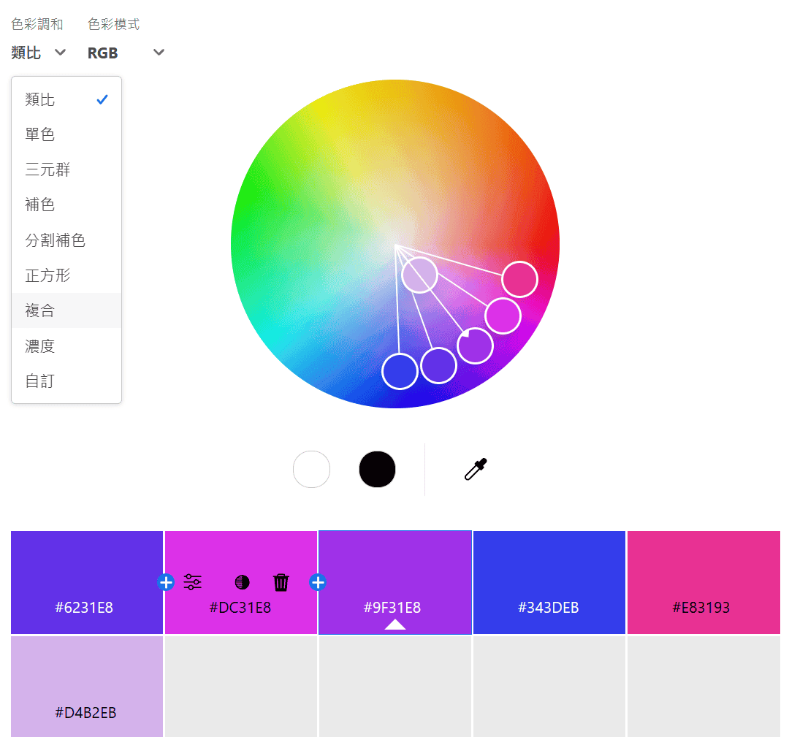
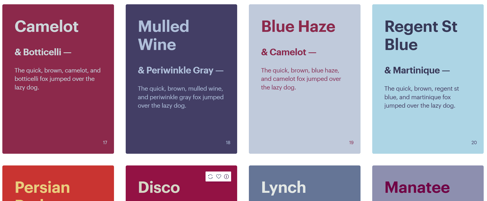
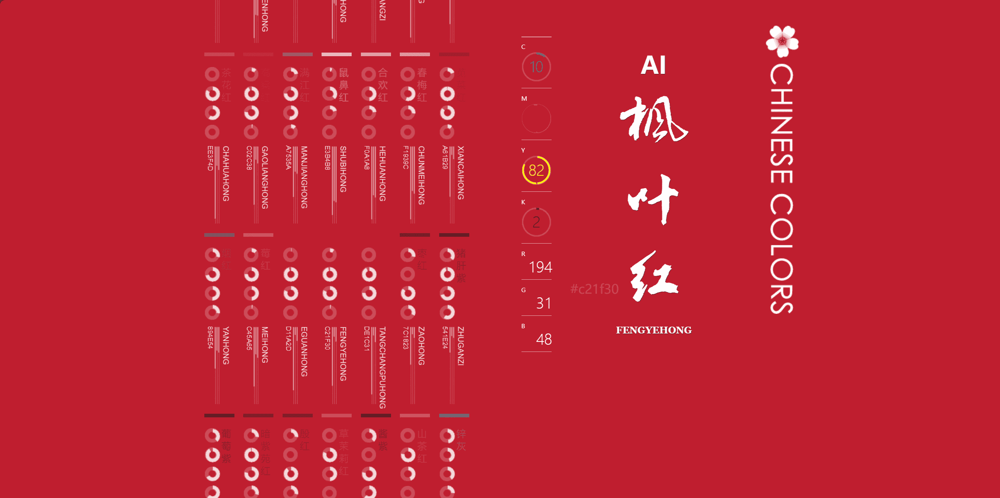
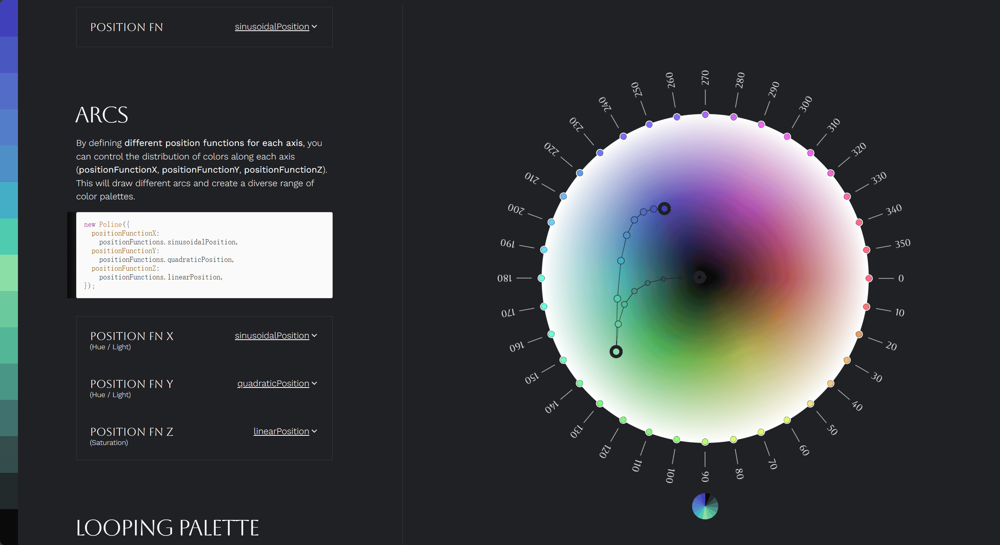

# 颜色收集与参考

## [Adobe Color](https://color.adobe.com/zh/create/color-wheel)

Adobe 提供的线上色彩选择工具，基于色彩轮，可以方便地从相似色、三元色、互补色等不同的色彩调和中选择，来创建和谐的配色方案。

## [Khroma](https://www.khroma.co/)

基于自己选择的颜色（60 种）经过训练生成一系列可能喜欢的颜色，非常具有启发性，且生成的颜色特别多，便于挑选。不只是颜色，它还可以生成渐变色、色彩搭配等。

## [Coolors](https://coolors.co/palettes/trending)

Coolors 是一个在线配色工具，可以让用户可以快速生成和分享配色方案，配色很全也都挺好看，要说缺点，就是访问很卡，有些时候还无法访问。

## [中国传统色](https://www.zhongguose.com/)

中国传统色参考，全屏颜色铺底非常适合观赏，但也算是个缺点，因为全屏颜色可能会让人产生一定的误差，全屏看上去挺好看，应用到自己页面上就不大适合。

另外，也可以参考[于此](../50-设计/01-中国传统色.md)来方便预览和复制中国传统色。

## [Poline](https://meodai.github.io/poline/)

作为一个神秘的配色方案生成器，其设计灵感来源于极坐标的神秘巫术。它的方法论挑战了传统的色彩科学，并且深深植根于 20 世纪早期的神秘知识之中。这项神奇的技术难以用言语解释，它通过在锚点之间绘制线条来产生视觉上引人注目且超凡脱俗的配色方案。对于现代的生成巫师来说，这是一个不可或缺的工具，同时对于眼睛来说也是一种享受。

