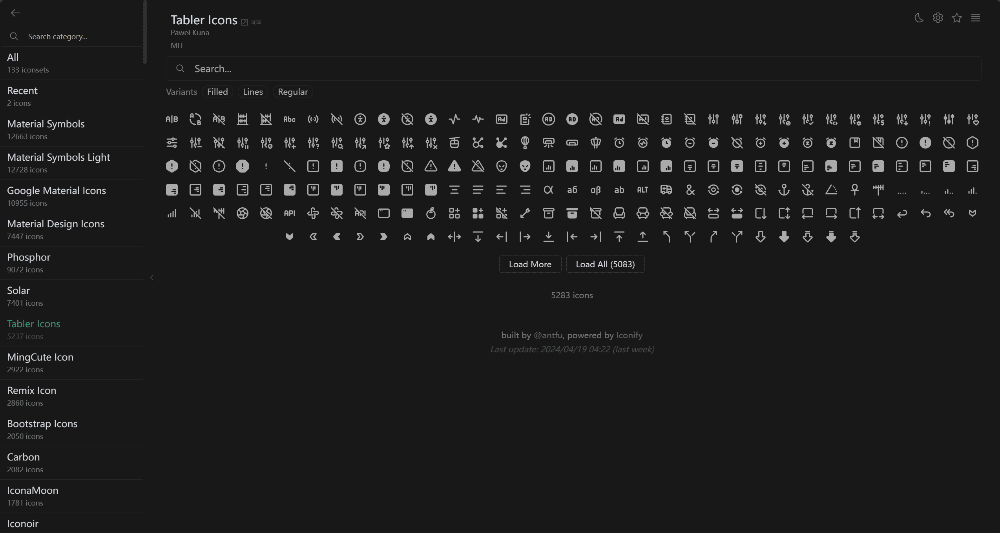
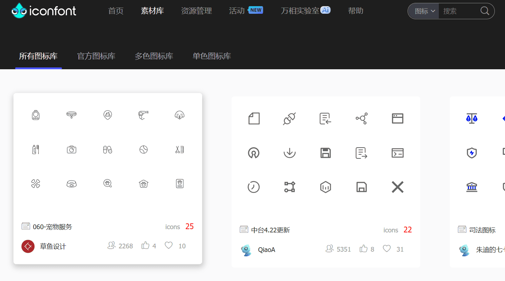
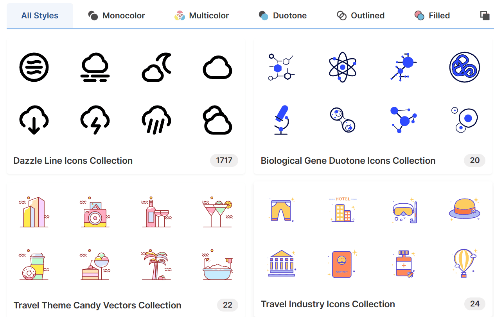
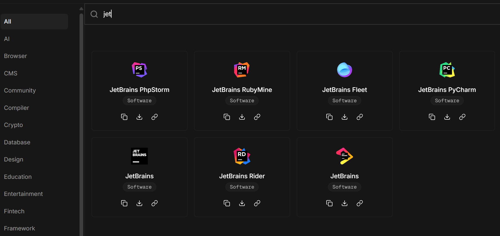
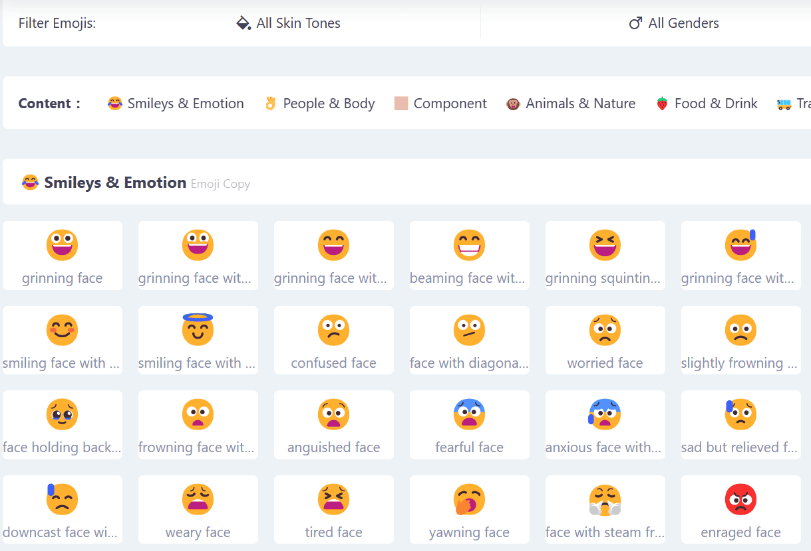
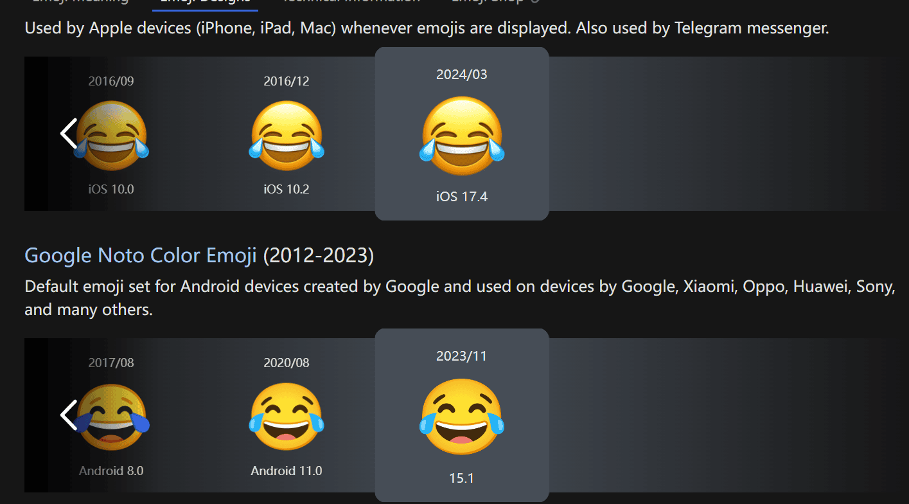

# 图标收集与参考

## [Icones](https://icones.js.org/)

浏览 Iconify 的全部图标，支持模糊搜索、SVG 下载、代码引用复制等，非常方便且全面。

## [Iconfont](https://www.iconfont.cn/)

非常全面的图标库，可以上传和下载各类图标和矢量插图等，也能快速和代码集成，不过需要注意内部图标的版权，并非完全可商用。

## [svgrepo](https://www.svgrepo.com/)

非常全的矢量图标库，可搜索下载，也可简单编辑 SVG 图标，很适合查找寻常图标库中没有的图标。

## [svgl](https://svgl.app/)

浏览和复制下载常用的软件或者库的图标。

## [Emoji All](https://www.emojiall.com/en/copy)

浏览和复制 Emoji。

## [Emoji Pedia](https://emojipedia.org/)

Emoji 大百科，查看 Emoji 的发展和演化。

