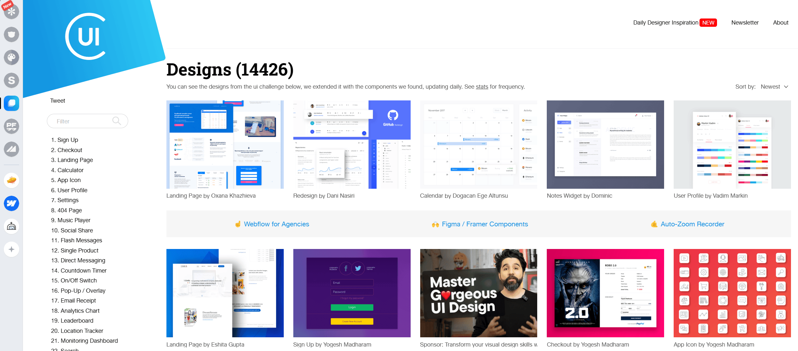
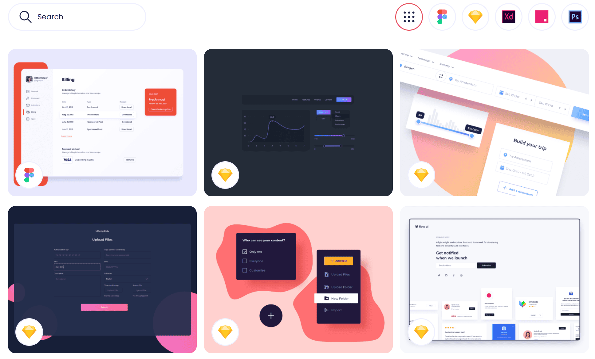

# UI 收集与参考

## [Collect UI](https://collectui.com/)

一个专为设计师打造的灵感资源推荐社区。

- **内容丰富**：Collect UI 网站收录了大量移动端和桌面端的设计作品，涵盖了各种页面类别，如登录界面、注册界面等。
- **高质量资源**：该网站每天都会更新高质量的 UI 作品，能够紧跟设计变化的时代步伐。所有收录的案例都是经过人工筛选的，确保了资源的质量和实用性。
- **分类详细**：在网站分类中，划分出了多达 100 多种不同的页面类别。这样的分类方式使得设计师在搜索不同类别时可以更加清晰、快速地定位到所需的内容。
- **与 Dribbble 的关联**：Collect UI 是基于 Dribbble 的资源共享社区。设计师在 Collect UI 上发现喜欢的作品后，可以直接追踪到 Dribbble 关注其作者，进一步探索更多精彩设计。

## [UI Design Daily](https://www.uidesigndaily.com/)

UI Design Daily 主要提供 Sketch、PS、Figma、Xd、Studio 五大标签类型的 UI 资源分类，内容覆盖 Web、移动端、桌面应用等多种领域和类型的设计。

