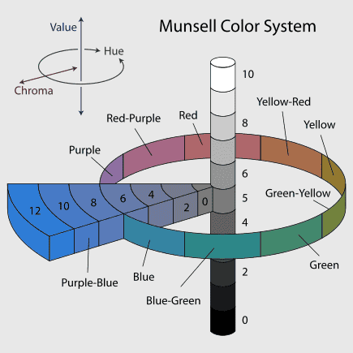

# 孟塞尔颜色系统

## 简述

孟塞尔颜色系统通过三个属性来描述颜色：

1. 色相(Hue)
2. 明度(Value)
3. 纯度(Chroma)

此三者的关系如图所示:

更详细的资料请参考以下链接：

1. [维基百科](https://en.wikipedia.org/wiki/Munsell_color_system)
2. [官网](https://munsell.com/)

## 颜色索引

为了方便检索颜色，以下提供一个简单的应用：

> 点击色相环颜色可以切换色板，点击色板颜色块可以快捷复制颜色值

<Munsell/>
