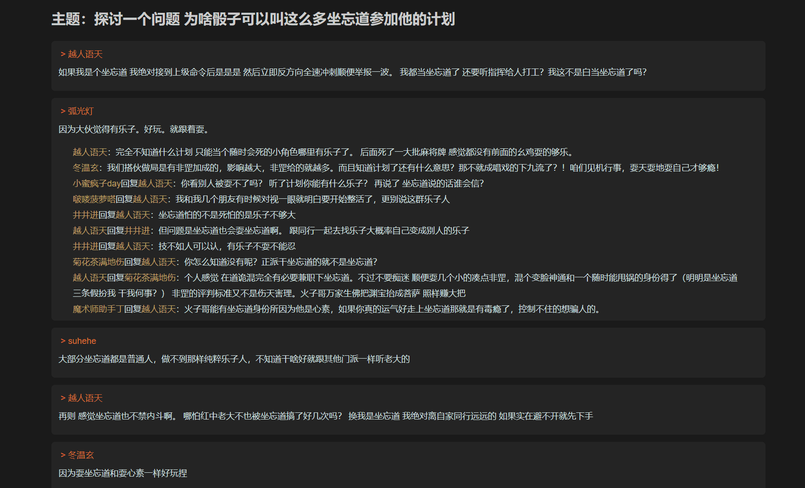

# 油猴脚本

油猴脚本（Tampermonkey，现在改名叫篡改猴了）具有多种用途，它主要用于插入自定义 JS 脚本以增强或定制网页浏览体验，实现自动化操作，以及解决特定网站的功能缺失或不便之处，以下是油猴脚本的一些主要用途：

1. **个性化网页布局与样式**：

   - 修改网页主题色、字体、间距等，实现个性化外观。
   - 隐藏广告、无关元素或烦人的通知，以提升阅读或浏览体验。
   - 添加或移除页面功能，比如自定义导航菜单、调整内容排序等。

2. **功能增强与补充**：

   - 实现一键下载网页内容（如图片、视频、文本）或批量下载资源。
   - 添加快捷键、鼠标手势等交互方式，以提高操作效率。
   - 在网页上集成翻译工具、字典查询、笔记功能等实用工具。
   - 解析或揭示隐藏信息，例如显示评论的完整内容、展开折叠内容等。

3. **数据提取与自动化处理**：

   - 抓取网页数据（如价格、商品信息、社交媒体统计数据）并导出为 CSV、JSON 等格式。
   - 自动填充表单、批量提交数据，以减轻重复输入的负担。
   - 实现网页内容的自动化筛选、聚合或分析，便于信息管理和研究。

4. **网页性能优化与安全增强**：

   - 屏蔽跟踪脚本、第三方资源，以减少页面加载时间并保护隐私。
   - 禁止自动播放视频、音频，以防止意外噪音干扰。
   - 阻止恶意弹窗、重定向或欺诈性内容，以提升浏览安全性。

5. **绕过网站限制或修复网站问题**：

   - 解除地域限制，访问受限内容，如观看地区锁定的视频、访问被封锁的网站。
   - 修复网站的已知 bugs 或兼容性问题，以确保功能正常运行。
   - 恢复被网站移除或更改的功能，如恢复旧版界面、找回已删除的按钮等。

6. **开发者工具与调试助手**：
   - 添加额外的开发者工具，例如 CSS 查看器、DOM 路径显示、AJAX 请求监视器等。
   - 快速切换 User-Agent 字符串，以模拟不同的浏览器或设备。
   - 注入测试代码、进行临时修复，以辅助网页开发与调试工作。

网上有很多别人分享的脚本，比如说百度云下载、CSDN 美化及未登录状态功能增强等，当然，平常如果想要给网页稍加定制，也可以很方便地插入自己的脚本。

## 插入自定义脚本

以百度贴吧为例，寻常状态下贴吧的样式不甚好看：


借助油猴插件，我们可以插入自定义脚本，脚本的作用范围也可以正则匹配 URL。

```js
// ==UserScript==
// @name         百度贴吧精简
// @namespace    http://tampermonkey.net/
// @version      0.1
// @description  简化百度贴吧的布局，只查看帖子和回复的内容
// @author       You
// @match        https://tieba.baidu.com/p/* [!code highlight]
// @icon         https://www.google.com/s2/favicons?sz=64&domain=baidu.com
// @grant        none
// ==/UserScript==
```

脚本的内容就是常规的 IIFE 函数：

```js
;(function () {
  'use strict'
  const style = document.createElement('style')
  style.appendChild(
    document.createTextNode(`
      // 自定义CSS
      // ...
    `)
  )
  document.head.appendChild(style)

  // 自定义脚本
  const authors = document.querySelectorAll('.d_author')
  for (let author of authors) {
    const elPost = document.createElement('div')
    // ...
  }
})()
```

插入脚本后，刷新页面便会立刻生效：


