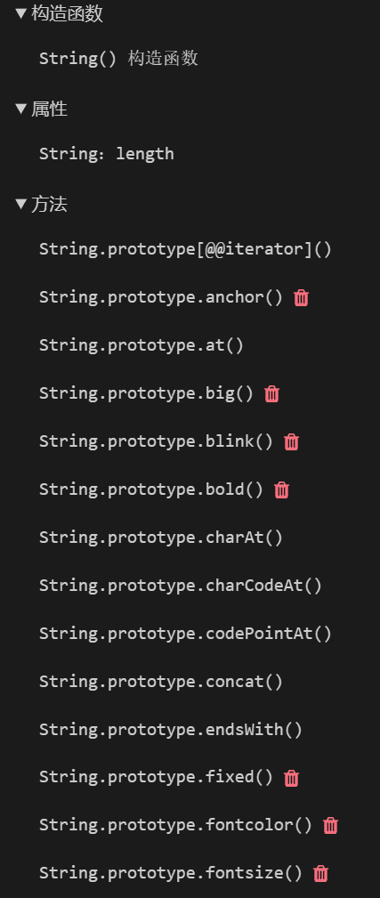

# 原型链是什么

为了直观地说明原型链是什么，先看一段代码：

<<<assets/prototype-01.js

:::tip
请打开控制台查看上述 JS 的实际输出
:::

经过上述车轱辘话来来回回地反复说了又说，我们可以总结出以下三点，最起码得要能分清楚 `__proto__`、`prototype`和`Object.getPrototypeOf`这几个名词才行，如果不能分清楚，那可能还需要看几遍上面的代码和其运行的结果。

1. `__proto__`是野路子写法，因为多数 JS 环境都实现了这个属性，因此也经常被用到，但因为它不是语言标准，所以尽量避免使用。

:::danger **proto**不是标准
已弃用: 不再推荐使用该特性。虽然一些浏览器仍然支持它，但也许已从相关的 web 标准中移除，也许正准备移除或出于兼容性而保留。请尽量不要使用该特性，并更新现有的代码；参见本页面底部的兼容性表格以指导你作出决定。请注意，该特性随时可能无法正常工作。
:::

:::info **proto**的替代
备注： 使用 **proto** 是有争议且不被鼓励的。它的存在和确切行为仅作为遗留特性被标准化，以确保 Web 兼容性，但它存在一些安全问题和隐患。为了更好的支持，请优先使用 Object.getPrototypeOf()/Reflect.getPrototypeOf() 和 Object.setPrototypeOf()/Reflect.setPrototypeOf()。
:::

2. `Object.getPrototypeOf()`是`__proto__`的标准写法，两者是一样的，后续的段落里一般只用`__proto__`。

:::info 为何写博客时用非标准的`__proto__`
为什么不用标准的`Object.getPrototypeOf()`，大概是因为懒吧，而且`__proto__`比较适合写在等式中，但需要注意，正式环境下使用`__proto__`是应当被禁止的。
:::

3. `prototype`是函数特有的属性，普通对象是没有这个属性的，它的作用是共享实例的一部分内容以节省内存。

好了，上面又是车轱辘话说了一大堆，那我们不禁要问，说了这么多，那到底什么是~~他妈的~~原型链！

:::tip 终于说出的原型链的定义
原型链是 JavaScript 中实现继承的一种机制，在 JavaScript 中，每个对象都有一个指向其原型对象的内部链接（`__proto__`），这个原型对象也是一个对象，它有自己的属性和方法，其中可能包括指向另一个原型的链接，如此层层递进，直到达到一个原型为 null 的对象为止，这样就形成了一条原型链。当一个对象访问某个属性时，如果该对象自身没有这个属性，JavaScript 就会沿着原型链向上查找，直到找到该属性或者达到原型链的顶端（null）为止。这种方式允许对象从它的原型及原型链上的其他对象那里继承属性和方法。
:::

之所以上面要说那么多内容，就是为了原型链的定义，举例来说，`张三`这个对象上并没有`sayHi`方法，于是去`张三.__proto__`上，也就是去`Person.prototype`上找，而`Person.prototype.sayHi = sayHi`，因此可以调用到`sayHi`方法。

拿一个更通用的例子来说，我们经常会调用`string.toUpperCase()`这样的函数，字符串本身肯定是没这个方法的，因此会去`String.prototype`上找，这上面就有一大堆和字符串相关的方法，因此可以正确调用，如果有注意到 MDN 上的菜单，也可以看出这一点来：

