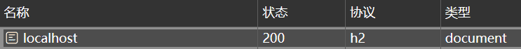

# 如何将网站升级到 http/2

:::info MDN
HTTP/2 是 HTTP 网络协议的一个重要版本。HTTP / 2 的主要目标是通过启用完整的请求和响应多路复用来减少 延迟，通过有效压缩 HTTP 标头字段来最小化协议开销，并增加对请求优先级和服务器推送的支持。

HTTP/2 不会修改 HTTP 协议的语义。HTTP 1.1 中的所有核心概念（例如 HTTP 方法，状态码，URI 和 headers）都得以保留。而是修改了 HTTP/2 数据在客户端和服务器之间的格式（帧）和传输方式，这两者都管理整个过程，并在新的框架层内隐藏了应用程序的复杂性。所以，所有现有的应用程序都可以不经修改地交付。
:::

根据描述，http/2 拥有诸多优点，接下来便以 Koa 为例来说明如何将默认的 http/1.1 改成 http/2。

首先，写一个平常的 koa 服务：

```js
import Koa from 'koa'

const app = new Koa()

app.use((ctx) => {
  ctx.type = 'html'
  ctx.body = `<h1>HELLO</h1>`
})

app.listen(3000, () => {
  console.log('listening: http://localhost:3000')
})
```

不做特殊设置的情况下，可以根据响应头看出，使用的是默认的 http/1.1：

```text{1}
HTTP/1.1 200 OK
Content-Type: text/html; charset=utf-8
Content-Length: 13
Date: Thu, 25 Apr 2024 02:50:27 GMT
Connection: keep-alive
Keep-Alive: timeout=5
```

为了使用 http/2，我们需要借助于`node:http2`，根据文档得知，`http2`有两个创建服务的方法:

1. createServer
2. createSecureServer

但实际上这里有特殊说明：

:::warning
由于没有已知的浏览器支持未加密的 HTTP/2，因此在与浏览器客户端通信时必须使用 http2.createSecureServer()。
:::

于是，我们只能使用`createSecureServer`了，于是可以写下如此代码:

```js
import http2 from 'node:http2' // [!code highlight]
import Koa from 'koa'

const app = new Koa()

app.use((ctx) => {
  ctx.type = 'html'
  ctx.body = `<h1>😵</h1>`
})

// app.listen(3000, () => {
//   console.log('listening: http://localhost:3000')
// })

http2.createSecureServer({}, app.callback()).listen(3000, () => {
  console.log('listening: https://localhost:3000')
})
```

然而，这样写并不能直接访问，因为`createSecureServer`要求使用 https，我们还得给服务带上 SSL 证书才行，生成自签名的证书详见[于此](./02-如何生成自签名的SSL证书.md)。

生成证书之后，修改代码如下:

```js
http2
  .createSecureServer(
    {
      cert: readFileSync('./assets/certificate.pem'),
      key: readFileSync('./assets/private_key.pem'),
    },
    app.callback()
  )
  .listen(3000, () => {
    console.log('listening: https://localhost:3000')
  })
```

如此便可以启用 http/2 了。



```text
Content-Length: 13
Content-Type: text/html; charset=utf-8
Date: Thu, 25 Apr 2024 03:48:06 GMT
```

:::info http/2 响应标头的差异
在 Chrome 开发者工具（DevTools）中，HTTP/2 响应头部通常不会像 HTTP/1.1 那样直接显示“原文”（raw）格式。这是因为 HTTP/2 协议对头部进行了压缩和编码，与 HTTP/1.1 的纯文本格式有所不同。

HTTP/2 使用了 HPACK 算法对头部进行压缩，以提高传输效率。因此，当你在 Chrome DevTools 中查看 HTTP/2 响应时，它通常会显示解压后的头部信息，而不是原始的压缩数据。
:::

:::info 不安全的证书
注意到即使是使用了自签名证书，Chrome 依旧会提示网站不安全，这点在测试时无需在意，因为我们的证书是自签名的，没有权威性。


:::
