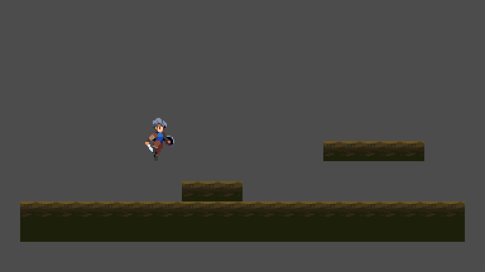

# 简单横版游戏制作 01

此文以简单的横版游戏《勇者传说》来简述 Godot 的基本功能和特性。

:::info 参考
原教程视频地址

[十分钟制作横版动作游戏](https://www.bilibili.com/video/BV1SP411m7aj/?share_source=copy_web&vd_source=36b097951318c19125635a785ee3cdcf)

人物素材

https://brullov.itch.io/generic-char-asset [备用](https://store-1258290249.cos.ap-guangzhou.myqcloud.com/others/generic_char_v0.2.zip)

环境素材

https://anokolisa.itch.io/sidescroller-pixelart-sprites-asset-pack-forest-16x16 [备用](https://store-1258290249.cos.ap-guangzhou.myqcloud.com/others/Legacy-Fantasy%20-%20High%20Forest%202.0.zip)

> 备用链接供[itch.io](https://itch.io/)访问不了时使用

:::

## 基础项目

### 窗口大小设置

像素风的游戏素材分辨率相对较小，但游玩时如果视口（游戏窗口区域）大小和像素素材分辨率的尺寸保持一致就会导致视口太小看不清，因此针对像素风游戏，一般需要设置视口的缩放比例：

1. 项目设置中，视口大小是逻辑分辨率，和像素风素材的分辨率对应；
2. 项目设置中，视口覆盖大小是显示分辨率，就是游戏窗口的实际大小，对于像素游戏而言，可以设置为视口大小的两三倍这样；
3. 设置了视口大小和视口覆盖大小不匹配后，就需要设置内部素材的拉伸模式，针对 2D 的像素风游戏，可以设置为`canvas_items`；

### 基本地图绘制

横板游戏中，地图多数以`TileMap`（瓦片地图）的形式添加，步骤如下：

1. 添加 TileMap 子节点
2. 给 TileMap 添加一层物理层，供后续使用
3. 在 TileMap 属性中设置 Tile Set 属性，也就是瓦片地图的素材图集
4. 设置 Tile Set 后，便可以从图集中选择需要的图块（也就是瓦片）来绘制地图
5. 选择需要的瓦片后，因为游戏中角色肯定需要站在瓦片上，因此需要将瓦片添加到瓦片地图的物理层中，这样才会有物理交互
6. 设置好图集所需的瓦片后，便可以在 TileMap 中进行地图的绘制

:::details TileMap 解释
Tilemap（瓦片地图）是一种在游戏开发和图形设计中常用的数据结构，用于创建和显示由小的、重复的图形单元（瓦片）组成的大型网格。每个瓦片可以代表不同的地形、物体或背景元素。Tilemap 通常用于 2D 游戏和图形界面设计中，因为它们可以有效地存储和渲染大面积的图形数据。

在游戏开发中，Tilemap 有以下几个关键特点：

1. **可重复性**：瓦片地图由重复的瓦片组成，这意味着相同的瓦片可以在地图上多次使用，从而节省资源和提高开发效率。

2. **可编辑性**：Tilemap 通常与编辑工具集成，允许开发者通过拖放瓦片来创建和修改地图。

3. **性能优化**：由于瓦片地图的重复性质，它们可以被优化以减少内存使用和提高渲染速度。

4. **层级结构**：Tilemap 可以包含多个层，每个层可以有不同的瓦片集合，用于创建复杂的场景和效果。

5. **动态交互**：在某些游戏中，Tilemap 可以与游戏逻辑交互，例如，瓦片可以代表可行走的地面或不可通过的障碍物。

6. **像素艺术**：在像素艺术风格的游戏中，Tilemap 常用于创建具有复古感的视觉效果。

7. **自动化生成**：一些游戏使用算法来自动生成 Tilemap，创建随机或程序化的地图布局。

Tilemap 在游戏引擎中通常有专门的支持，如 Godot、Unity 和 Unreal Engine 等，它们提供了内置的 Tilemap 系统或插件，以简化开发流程。
:::

绘制好基本的地图后，就可以添加基本的角色了。

### 基本角色添加

新建一个场景，添加一个`CharacterBody2D`节点，作为角色的容器，后续步骤如下：

1. 增加 Sprite2D 子节点作为角色的素材容器，导入素材图片
   1. 导入素材后可能会发现像素图不甚清晰，这是因为采用了默认的抗锯齿设定，但不适用于像素画，需要在*项目设置>渲染>纹理>默认纹理过滤*中由默认的 Linear 改为 Nearest
2. Sprite2D 只是为角色添加渲染样式，不包含物理属性，因此需要再添加一个子节点 CollisionShape2D，添加后，设置碰撞区域为长方形，将碰撞区域一移动到人物素材的合适区域
3. 导入素材后，就需要为角色的每个动作分配素材中的一部分区块，为了添加角色动作，需要添加一个 AnimationPlayer 子节点，在其中给角色添加 idle、running 和 jump 动作
4. 因为各个动作的素材区域和帧数量不同，因此采用关键帧给每个动作设置独特的素材区域和素材帧数量，通过切换帧索引来呈现动画的效果
5. 人物的素材和对应的动作添加完毕后，还缺少控制逻辑，因此需要在 CharacterBody2D 根节点上添加脚本来实现控制逻辑

脚本逻辑编辑步骤大概如下：

1. 设置按键映射，将常见的 WASD 等按键定义一个有意义的名字
2. 根据按键按下情况检测当前人物的运动状态，是向右向左还是不动等
3. 根据运动状态设置角色速度
4. 根据运动状态播放 AnimationPlayer 中预定的动作
5. 根据运动状态设置是否翻转 sprite2D 的水平方向，因为我们的素材都是向右的，翻转一下就是向左

> 脚本内容这里不说明，后续会放出源码

:::details CharacterBody2D 解释
在游戏开发中，`CharacterBody2D` 通常指的是一个 2D 游戏角色的身体组件或类，它负责处理角色的物理行为和动画。这个组件是游戏引擎中用来创建和控制 2D 角色运动的，它可能包含以下功能：

1. **物理属性**：包括质量、摩擦力、弹性等，这些属性影响角色在虚拟世界中的移动和互动。

2. **碰撞检测**：`CharacterBody2D` 组件能够检测角色与其他对象（如敌人、障碍物、地面等）之间的碰撞，并作出相应的反应。

3. **动画控制**：组件可能包含动画状态机，用于根据角色的动作（如行走、跳跃、攻击等）播放相应的动画。

4. **移动控制**：提供接口来控制角色的移动，包括速度、加速度和方向。

5. **输入处理**：处理玩家输入，如键盘、鼠标或游戏手柄的操作，并将这些输入转化为角色的动作。

6. **状态管理**：管理角色的不同状态，如站立、行走、跳跃、受伤等。

7. **响应事件**：角色可能会响应各种游戏事件，如受到伤害、拾取物品、触发机关等。

8. **集成传感器**：可能包含射线传感器等，用于检测角色前方是否有障碍物，从而实现智能行走或避免碰撞。
   :::

::: details 纹理过滤解释
在图形渲染和游戏开发中，纹理过滤是一个重要的概念，它决定了当纹理被映射到一个与其原始尺寸不符的表面时，如何进行采样和平滑处理。Linear（线性）和 Nearest（最近点）是两种常见的纹理过滤方式。以下是关于这两种方式的清晰归纳：

Linear（线性）纹理过滤

1. **原理**：线性过滤会在采样时对纹理周围的像素进行加权平均，以产生一个更为平滑的图像。

2. **效果**：这种方式通常会产生较为平滑的视觉效果，特别是在纹理被放大时，能够减少锯齿状边缘和像素化的外观。

3. **适用场景**：适用于需要较为平滑、自然的纹理过渡的场景，如远处的山景、水面等。

4. **缺点**：可能会导致图像变得稍微模糊，尤其是在纹理缩小或拉远时。

Nearest（最近点）纹理过滤

1. **原理**：最近点过滤会选择离采样点最近的纹理像素颜色作为输出颜色，不进行任何插值或平滑处理。

2. **效果**：这种方式会保留纹理的像素化外观，使得图像看起来更加锐利和“块状”。

3. **适用场景**：适用于需要保持纹理清晰度和像素艺术风格的场景，如像素风格的游戏、图标等。

4. **缺点**：在纹理放大时，可能会出现明显的锯齿状边缘和“阶梯效应”。

总的来说，Linear 和 Nearest 是两种截然不同的纹理过滤方式，分别适用于不同的场景和需求。在选择时，需要根据具体的视觉效果要求和性能考虑来做出决策。如果需要更为平滑的视觉效果，可以选择 Linear 过滤；而如果需要保持纹理的清晰度和像素化风格，则应该选择 Nearest 过滤。
:::

### 场景运行

地图和角色都设置好了后，就可以将角色添加到地图中实例化，然后运行就好，这样一个可控制、带动画和物理碰撞的最简易游戏场景就搭建好了。

### 相机跟随

角色可以移动之后，便会发现场景就只有窗口那么大，角色跑到边缘窗口位置也不会变化，这显然是不好玩的，因此需要设置更大的地图才行，更大的地图也就意味着需要添加一个相机视角，让相机跟随角色移动，具体步骤如下：

1. 加大场景，让场景大于视口的尺寸
2. 在角色上（注意是在角色上，层级关系很重要）添加 Camera2D 子节点，运行后就会发现已经有相机跟随了
3. 上述的相机跟随比较生硬，角色移动相机就会立刻移动，应该要改成角色跑到视口边缘再移动相机，因此需要设置相机水平和竖直方向的 Drag 属性为 true，同时设置相机移动的缓动为 true
4. 相机区域可能会拍到地图外的场景，因此需要设置相机的 Limition 属性，将相机限制在地图的区域内，这点在地图的\_ready 方法中通过代码设置会比较方便
5. 为了避免初始化时相机限制还没添加而导致的短时间拍到地图外内容，可以利用`reset_smoothing()`方法将相机的位置立即设置为其当前平滑的目标位置
