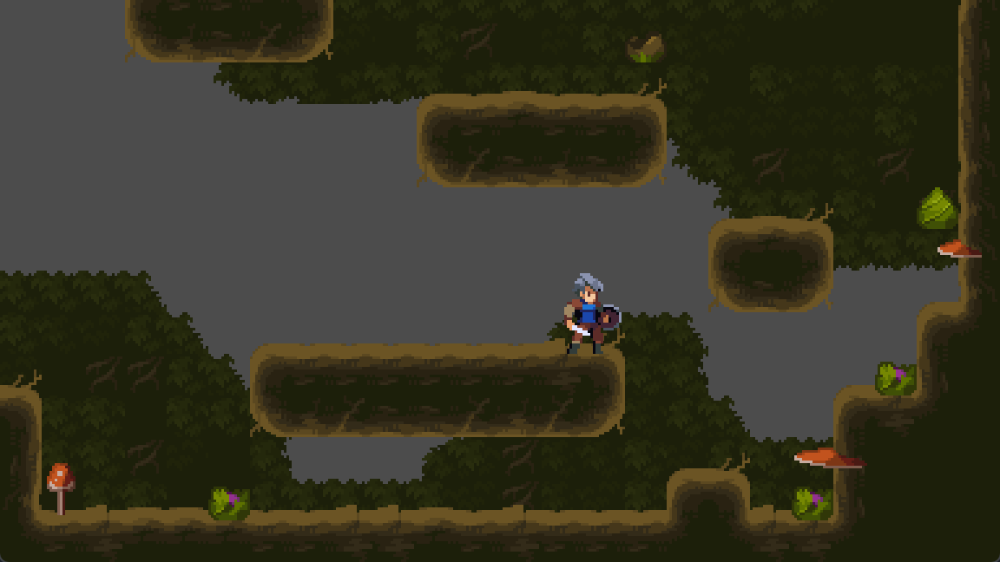
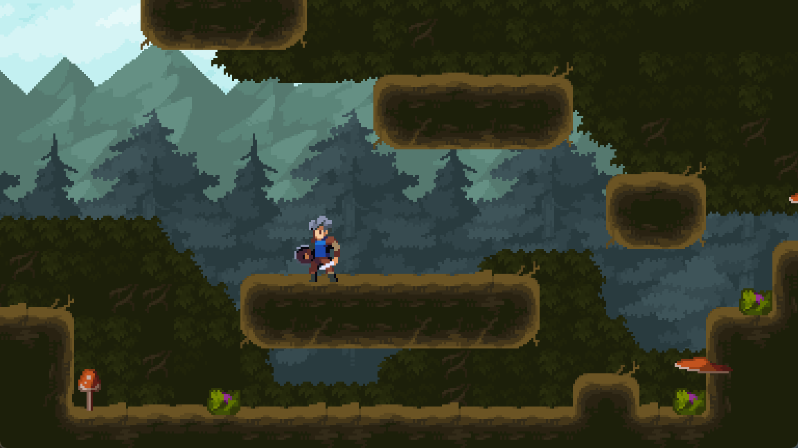

# 简单横版游戏制作 02

## 瓦片地图地形绘制

上面的教程中我们已经做好了一个角色可移动的基本场景，但场景的丰富度还很低，因此我们需要使用到素材图中的额外素材来绘制如下的地图。

原先地图

丰富后的地图

注意到地图的图块其实还是挺多的，我们虽然可以一块一块地选择素材，然后绘制达到类似的效果，但其中选择素材的过程就比较繁杂，幸运的是，Godot 中的瓦片地图有地形和图层的功能，地形可以自动化地为我们选择合适的图块来绘制区域，图层则可以让我们的绘制更具有层次性和美观性，具体的步骤如下：

1. 添加瓦片地图的 Terrian（地形）层，命名为 Gemotry
2. 在图集中选择更多的素材，然后添加到 Gemotry 地形中，绘制瓦片之间的连接遮罩图
3. 使用 Gemotry 地形层绘制地图，期间为了美观，可能需要调整地形中瓦片的出现概率等
4. 绘制好主体地图后，为了分析地图细节，再添加前景层和背景层，这两个图层不参与物理交互，前景层放一些点缀性的素材，如蘑菇、小草等，背景层放大面积的背景素材，如大块树叶等
5. 不断丰富地图以实现自己喜欢的场景

:::details Terrian 和 Layer 解释
好的，让我们专注于 2D 游戏开发中的 "terrain"（地形）和 "layer"（层）的概念。

**2D Terrain（2D 地形）**：
在 2D 游戏开发中，地形通常指的是游戏世界中水平面的表示，它可以由一系列的瓦片（tiles）组成，这些瓦片可以代表不同的地面类型，如草地、沙地、水域等。2D 地形的创建和表现通常涉及以下方面：

- **Tilemap**：地形可以通过 Tilemap 来实现，Tilemap 是一个由瓦片组成的网格，每个瓦片占据网格中的一个单元格。
- **Tileset**：用于 Tilemap 的瓦片集合，包含了用于创建地形的不同瓦片图案。

**2D Layer（2D 层）**：
在 2D 游戏设计中，层是用于组织和管理游戏元素的一种方式。层允许开发者将不同的游戏组件分开处理，提高游戏的组织性和可管理性。2D 层的应用包括：

- **背景层**：通常包含静态的背景元素，如天空、山脉等，可能使用 Parallax Scrolling 技术来增强视觉效果。
- **地形层**：直接与 Tilemap 相关，这一层包含了构成游戏世界地面的瓦片。
- **对象层**：可以包含游戏世界中的动态对象，如玩家角色、敌人、可交互物品等。
- **前景层**：位于对象层之上，通常包含那些应该在玩家角色和其他对象之上显示的元素，如掉落的物品、特效等。

**2D Terrain 和 2D Layer 的关系**：

- **地形作为层的一部分**：在 2D 游戏中，地形层可以被视为 Tilemap 中的一个或多个特定层，专门用于表示地面和环境。
- **层之间的交互**：不同的层可以相互交互，例如，玩家角色（在对象层）可以在地形层上移动，同时前景层的元素可能会根据玩家的行动而变化。
- **视觉和逻辑分离**：通过使用层，开发者可以将视觉元素（如背景和前景）与逻辑元素（如地形和对象）分开，使得游戏设计更加模块化和清晰。

在 2D 游戏引擎中，如 Unity 2D 或 Godot，通常会提供工具和组件来帮助开发者创建和管理 Terrain 和 Layer，从而简化游戏开发过程。
:::

## 视差背景

上面虽然丰富了地图的细节，但灰色的背景依旧是比较空旷，因此需要添加上天空、群山和森林这类的远景背景，这三类背景实际上也是分层次距离的，距离越远相对角色运动的就越慢，为了实现这样的效果，可以使用`ParallaxBackground`这个节点，具体如下：

1. 添加`ParallaxBackground`节点
2. `ParallaxBackground` 节点内部添加多个`ParallaxLayer`子节点，设置每层 Layer 水平和垂直的运动速度，越远速度越慢
3. Layer 层添加背景图片，因为背景图和地图宽高一般是不匹配的，因此通常需要设置 Layer 层的 mirroring 属性，以使背景图片宽高不够的时候进行复制填充（注意背景图至少要足够一个视口的宽高）

