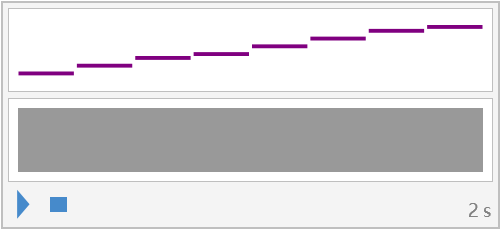
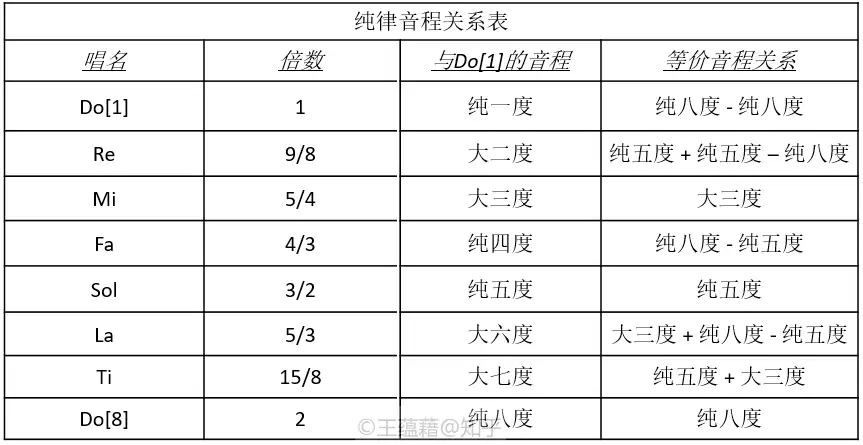

# 乐理入门 01

> 感谢[乐理 101](https://zhuanlan.zhihu.com/p/24538434)的通俗讲解。

## 八度

八度中“度”是衡量音高间距离（也就是音程）的单位，举例来说，从小我们就学过唱音符“Do, Re, Mi, Fa, Sol, La, Ti, Do”，注意到首位都有一个 Do 的音，唱的时候后面的 Do 明显比前面的 Do 音要高，而具体高多少，在乐理上也就是说高八度。

> 音高是指声音频率的高低，声音大小的高低才叫做音量，这点需要区分开来，可以将声音看作正弦函数，函数的频率就是音高，振幅就是音量。

> 注意到唱名中写的是“La, Ti”而不是小时候可能唱到的“La, Xi”或者“La, Si”，这主要是因为英美等国家中 Si 音容易和 C 混淆，国内用 Si 和 Ti 的都有，至于说 Xi，可能就只是我小时候唱错了的缘故 🥲。

:::info 唱名学习-音乐之声

<iframe src="//player.bilibili.com/player.html?isOutside=true&aid=540097581&bvid=BV1Di4y1b7E5&cid=172947067&p=1&autoplay=0" scrolling="no" border="0" frameborder="no" framespacing="0" allowfullscreen="true" height="500px"></iframe>
:::

从小时候的唱名可以听出，“Do, Re, Mi, Fa, Sol, La, Ti, Do”是可以一直唱下去的，只是音高会越来越高，这种循环关系实际上和人的听觉有关，要建立起循环，那就要保证后一个 Do 和前面的 Do 在听觉上具有共同性（不只是 Do，所有的前后唱名都有这样的关系），刚好，人的听觉系统就符合这样的规律，如果一个音的频率是另一个音的两倍，那听上去就比较相似，这便是八度会存在的原因，一个八度，恰好就是频率翻倍的过程，也就是说，后一个 Do 的音高就是前一个 Do 的两倍。

下面是“Do, Re, Mi, Fa, Sol, La, Ti, Do”的音高情况，可以看出音高是逐步加大的。

<audio controls src="./assets/基本唱名.wav"></audio>

## 八度、五度、三度和纯律

上述我们已经根据 Do[1]推导出了 Do[8]（这里中括号内的值可以表示音高），根据两倍关系，还可以自然地推出 Do[15]等，但很明显唱名中除了 Do 还有其它的几个，由于唱名的音高并非是随意决定的，得考虑到协调性，那大概路我们还是得从倍数关系来推导。

既然 2 倍关系可以实现非常协调的效果（协调到就是一个音），那 3 倍关系应当也是可以的，虽然 $Do[1] * 3$ 不在 Do[1] ... Do[8]之间，但根据 2 倍关系，$Do[1] * 3$ 和 $Do[1] * \frac{3}{2}$ 是一个音，后者恰好就在 Do[1] ... Do[8]之间，于是我们就自然地得出了 Sol[5]的音，Sol[5]的 2 倍就是 Sol[12]，也就是 $Do[1] * 3$ 的音高。

上述的 $\frac{3}{2}$ 倍的关系就叫<em c>纯五度</em>（暂时简称五度，至于为什么加一个纯的前缀，后续再说）。

既然根据 3 倍关系得出了 Sol[5]的音，那同样的道理根据 5 倍关系可以由$\frac{5}{4}$倍得出 Mi[3]的音，$\frac{5}{4}$倍也叫<em c>大三度</em>（同样简称为三度）。

到此为止似乎一切顺利，2 倍关系推出纯八度，3 倍推出纯五度，5 倍推出大三度，那似乎可以自然地说 7 倍推出 XX 度，9 倍推出 XX 度这些，但可惜的是，3 倍的协调性恰到好处，5 倍的协调性锦上添花（音乐并不是越协调就越好，不然 Do 一个音跳来跳出就可以了，显然就太单调，5 倍关系的不协调程度恰好给单调的音乐带来些别样感觉但又不至于太不协调），但 7 倍的协调性就不行了，于是被踢出了推导过程，9 被更不必说了。

既然 7 倍关系太不协调，那剩余的几个音该如何产生，于是乐理人灵机一动，不如从纯八度、纯五度、大三度中凑吧，比如说纯五度+纯五度-纯八度这种，最终，<em c>纯律</em>也就因此而生。

说了这么一大堆内容，7 个唱名终于是推出来了，至于为什么不多推一些，比如说弄 100 个唱名，或者少推一些，就 5 个唱名，这其中就是经验积累、科学道理、是否方便学习这些考虑的事情了，不多赘述。

## 五度相生律

数学好的人可能会敏锐地意识到纯律的一个弊端，那就是唱名之间的频率关系是不规律的，虽然 Do[1]、Mi[3]和 Sol[5]的频率关系挺直观，但其它的唱名间频率关系就挺奇怪了，举例来说：

| 唱名           | 频率关系        |
| -------------- | --------------- |
| Re[2] -> Fa[4] | $\frac{32}{27}$ |
| Re[2] -> La[6] | $\frac{40}{27}$ |

## 参考

### 乐理术语对照

| 中文 | 英文     |
| ---- | -------- |
| 音高 | Pitch    |
| 音量 | Volume   |
| 旋律 | Melody   |
| 音程 | Interval |
| 唱名 | Solfege  |
